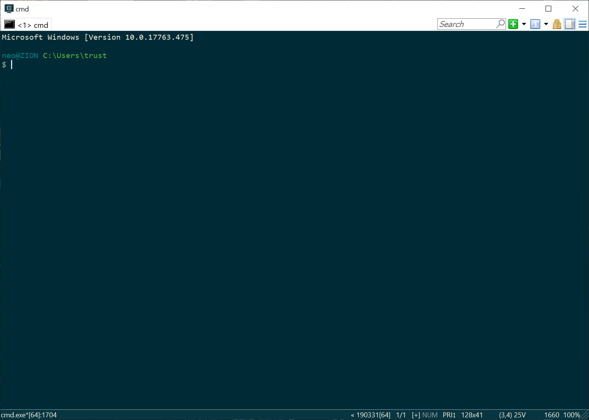
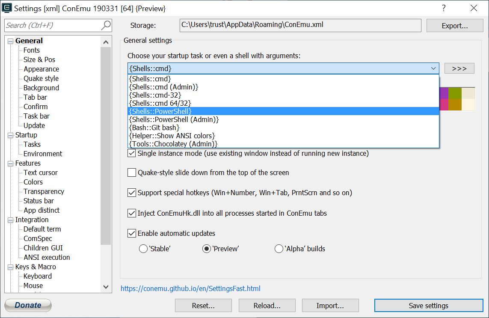
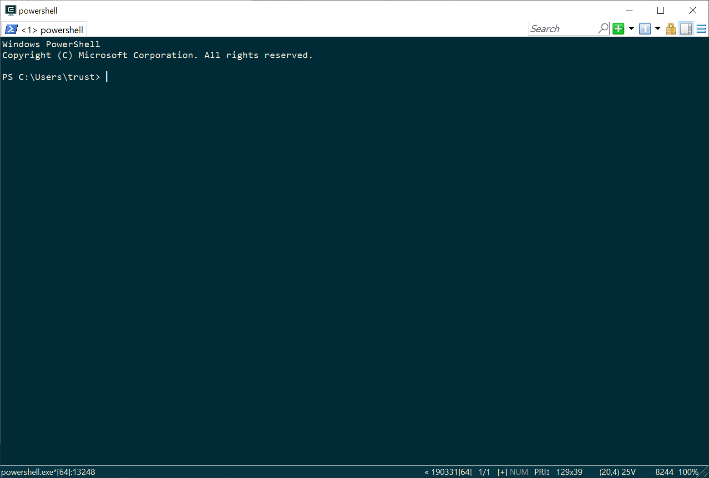
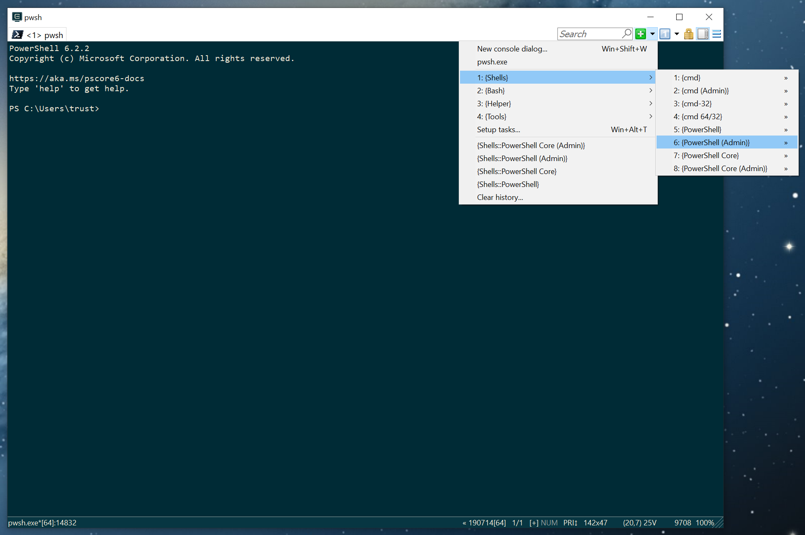
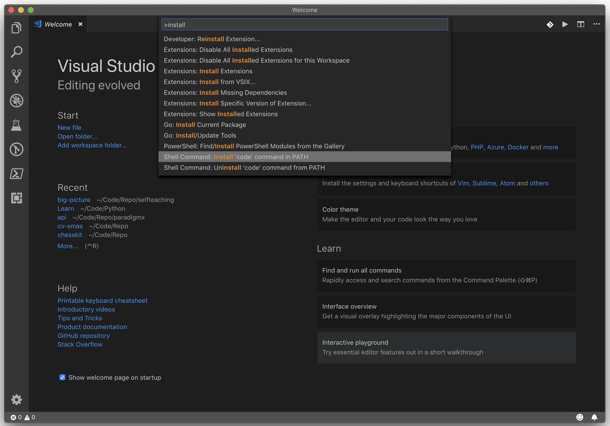

# 编程环境配置指南

> “工欲善其事必先利其器。”
> 
> ― 《论语·卫灵公》

这份 step-by-step 的指南将帮助你配置好一个可以用一辈子的编程环境。如果你使用的是 PC 电脑请看“Windows 篇”；如果使用的是 Mac 电脑请看“macOS 篇”。

## 符号说明

* ⌃ - Control 键，⇧ - Shift 键，⌥ - Alt/Option 键，⌘ - Command 键
* ↩︎ - 回车键，⇥ - Tab 键

## Windows 篇

* [视频指引](https://www.bilibili.com/video/av62640239/)

> 重要提示：具体操作请以下面的文字说明为准，视频指引仅供参考。

### 确认操作系统环境

我们推荐使用 Windows 10 操作系统，更老的 Windows 也许可以，但会增加不必要的麻烦。

**确认系统架构**

* 点击桌面左下角的搜索按钮，输入 `cmd` 运行命令行界面（Command Prompt）；
* 在命令行界面输入 `wmic CPU get DataWidth ↩︎`，返回的是 CPU 的架构，64 或 32 位；
* 在命令行界面输入 `wmic OS get OSArchitecture ↩︎`，返回的是 Windows 操作系统架构，64 或 32 位。

**确认 PowerShell 版本**

PowerShell 是 Windows 下的增强命令行环境，也是我们以后要用的主要命令行界面。以下操作继续在上面打开的命令行界面进行：

* 在命令行界面输入 `powershell ↩︎`，注意到命令行界面的行首提示信息出现了 `PS` 字样；
* 在命令行界面输入 `$PSVersionTable.PSVersion.Major ↩︎`。

上面的命令返回为 5 或者以上就没问题，否则需要下载并安装：
1. [.NET Framework 4.5 or later](https://www.microsoft.com/net/download)
2. [Windows Management Framework 5.x](https://aka.ms/wmf5download)

以上确认完毕可以在命令行界面输入 `exit ↩︎` 退出。

### 安装命令行界面 ConEmu

我们刚才已经用了 Windows 自带的命令行界面 `cmd.exe`（大名叫 Command Prompt），为啥还要另外装一个呢？因为这个更方便好用，可以减少不少以后的麻烦。

* 进入 [ConEmu 首页](https://conemu.github.io/)，点击 Download 按钮，选择下载 “ConEmu Alpha, Installer (32-bit, 64-bit)” 这个安装器版本；
* 运行下载好的 ConEmu 安装程序（通常叫 `ConEmuSetup.xxxxx.exe`），如果前面检查的 Windows 版本为 64 位就选择安装 x64（64位）版本，否则选择 x86（32位）版本；安装时有的防病毒软件可能会报出病毒警告，请放心继续安装，这是[误报](https://conemu.github.io/en/FalseAlarms.html)。

安装完毕运行 ConEmu，应该可以看到下面这样的界面：



* 点击 ConEmu 右上角最右边的按钮，从弹出菜单中选择 Settings，在打开的设置窗口将下图所示的选项改为 {Shells::PowerShell}，点击 Save settings 来保存修改：



* 现在退出 ConEmu 然后重新运行它，这次应该进入一个 PowerShell 环境，注意每行开始的提示符变成了 PS：



以后当我们说“打开命令行界面运行 xxxx 命令”的时候，就是指在上图这个 PowerShell 界面下输入 `xxxx ↩︎`。

有时候我们需要以管理员的权限执行一些命令行命令，那么就需要启动 ConEmu 然后打开一个管理员权限的 PowerShell 界面，方法是选右上角的绿色加号然后按下图选择：



现在我们先不要关闭 ConEmu，继续下一步。

### 安装软件包管理工具 Scoop

在我们的编程生涯中会用到很多命令行软件，安装、卸载、更新和管理这些软件最简单的办法就是使用一个好用的软件包管理工具，Windows 下最好的命令行软件包管理工具就是 [Scoop](https://scoop.sh/)。

下面的操作就在上一步打开的 ConEmu 的 PowerShell 命令行界面下运行：

* 输入 `Get-ExecutionPolicy ↩︎` 一般来说系统应该返回 `Restricted`；
* 输入 `Set-ExecutionPolicy RemoteSigned -scope CurrentUser ↩︎`；
* 输入 `iex (new-object net.webclient).downloadstring('https://get.scoop.sh') ↩︎`
* 等待上述安装程序运行完毕，如果中间有报错可以把错误提示截屏或者拷贝保存下。

如果运行无误，Scoop 就安装好了，我们可以运行 `scoop update` 然后 `scoop list` 来测试一下，因为目前还什么都没安装过，所以 `scoop list` 显示应该是空的。

安装好 Scoop 之后我们建议立刻安装三个软件包，运行：

```shell
scoop bucket add versions
scoop update
scoop install busybox git python37
```

* *busybox* 包括一系列常用的命令行命令，都是 Linux 和 macOS 下自带和经常使用的，安装这个包之后可以在 Windows 下使用和其他操作系统类似的命令；
* *git* 是用于文件版本管理和协同的重要工具，大名鼎鼎的“程序员交友社区” [GitHub.com](https://github.com/) 就是建立在 *git* 基础之上的；
* *python37* 这个包会安装 Python 3.7.x 完整的运行环境。

> 目前 Python 3.8.0 已经正式发布，Scoop 上最新的 python 包就是 3.8.x 版本，但因为太新，还有不少第三方程序没有完全兼容，我们学习仍需要使用 3.7.x（目前最新是 3.7.5）版本，所以指定 Scoop 安装 python37 这个包。

> 把 GitHub.com 叫“交友社区”是个梗，其实 GitHub 是用于分享和协同开发的在线服务。

上述安装命令运行完毕之后可以再次运行 `scoop list`，应会列出已经安装好的这三个软件包。我们还可以输入 `python -V` 来查看安装的 Python 的版本。

### 安装 Visual Studio Code

Visual Studio Code 是微软开发并开源的程序源代码编辑器（以下简称 VSCode），VSCode 集成了对各种编程语言和工具的支持，我们写程序代码和文档都可以用它。

* 访问 [Visual Studio Code](https://code.visualstudio.com/) 主页并点击下载按钮，下载时注意看清楚是和自己的操作系统一致（Windows）的版本；
* 运行下载好的 VSCode 安装程序（通常叫 `VSCodeUserSetup-xxx-1.xx.x.exe`）。

安装好后即可从 Windows 开始菜单运行 VSCode，也可以从命令行运行，回到 ConEmu 窗口，在命令行界面操作：

* 输入 `mkdir Code ↩︎` 在用户主目录下创建一个叫 `Code` 的子目录，以后我们写的代码都可以放在这里；
* 输入 `cd Code ↩︎` 进入 Code 子目录；
* 输入 `code . ↩︎` 这里 `code` 是运行 VSCode 的命令行命令，后面跟的参数是命令 VSCode 打开的文件或者文件夹，这里我们用一个点 `.` 代表“当前目录”，所以此命令会运行 VSCode 并打开 `Code` 这个目录；

现在 `Code` 目录下什么都没有，可以试着创建一个新文件：

* 在 VSCode 中按 ⌃+N 打开一个新文件，输入 `print('Hello world!')`，然后按 ⌃+S 保存，文件名为 `hello.py`；

回到 ConEmu 窗口，然后：

* 输入 `ls ↩︎`，应该可以看到刚才新建的文件 `hello.py`；
* 输入 `python hello.py ↩︎` 应该可以看到运行 `hello.py` 程序的结果。

恭喜，你的 Windows 系统已经是 *programming ready* 状态，可以继续[下一步](x2-students-book.md)了。

## macOS 篇

* [视频指引](https://www.bilibili.com/video/av62687425/)

> 重要提示：具体操作请以下面的文字说明为准，视频指引仅供参考。

### 命令行界面

macOS 本质上是 Unix，所以命令行界面是自带现成的，在 macOS 按 ⌘+空格 键调出系统搜索框（大名叫 Spotlight），输入 `terminal ↩︎`，打开的窗口叫 Terminal，这就是 macOS 的命令行环境。

### 安装软件包管理工具 Homebrew

在我们的编程生涯中会用到很多命令行软件，安装、卸载、更新和管理这些软件最简单的办法就是使用一个好用的软件包管理工具，macOS 下最好的命令行软件包管理工具就是 [Homebrew](https://brew.sh/)。

下面的操作就在上一步打开的 Terminal 命令行界面下运行：

* 输入：`xcode-select --install ↩︎` 这个命令会安装 Apple 开发工具包，是 Homebrew 需要的；
* 输入：`sudo xcodebuild -license accept ↩︎` 这个命令的作用是阅读和同意 Xcode 的授权协议；当提示输入 `Password:` 的时候输入你的登录密码并回车（下同）；
* 输入：`/usr/bin/ruby -e "$(curl -fsSL https://raw.githubusercontent.com/Homebrew/install/master/install)" ↩︎` 这个命令将自动安装 Homebrew 到 /usr/local/ 目录下；
* 运行 Homebrew 自更新命令：`brew update ↩︎`
* 运行 Homebrew 自检命令：`brew doctor ↩︎`

如果上面的命令没有错误，Homebrew 就安装好了，我们建议立刻安装两个软件包，运行：

```shell
brew install git python ↩︎
```

* *git* 是用于文件版本管理和协同的重要工具，大名鼎鼎的“程序员交友社区” GitHub.com 就是建立在 *git* 基础之上的；
* *python* 这个包会安装 Python 完整的运行环境。

> 目前 Python 3.8.0 已经正式发布，但 Homebrew 上最新的 python 包仍是 3.7.4 版本；因为 3.8 太新，还有不少第三方程序没有完全兼容，我们学习仍需要使用 3.7.4 版本，所以指定 Homebrew 安装 python 包。以后 Homebrew 的 python 包应该会升级到 3.8.x，那时我们也会随之更新这个指引。

> 把 GitHub.com 叫“交友社区”是个梗，其实 GitHub 是用于分享和协同开发的在线服务。

上述安装命令运行完毕之后可以运行 `brew list`，应会列出已经安装好的这两个软件包以及所有自动安装的依赖包。我们还可以输入 `python3 -V` 来查看新安装的 Python 的版本。

### 安装 Visual Studio Code

Visual Studio Code 是微软开发并开源的给程序员用的文本编辑器（以下简称 VSCode），VSCode 集成了对各种编程语言和工具的支持，我们写程序代码和文档都可以用它。

* 访问 [Visual Studio Code](https://code.visualstudio.com/) 主页并点击下载按钮，下载时注意看清楚是和自己的操作系统一致（macOS）的版本；
* 解压下载文件（通常叫 `VSCode-darwin-stable.zip`）会得到 VSCode 应用程序，将其拖到 Applications 目录即可。

按 ⌘+空格 键调出 Spotlight，输入 `code` 应该可以看到 Visual Studio Code 出现在第一选项，回车即可运行 VSCode。

* 在 VSCode 中按 ⌘⇧+P 打开命令窗口，输入 install，从弹出的命令中选择 Shell Command: Install 'code' command in PATH，这样以后我们可以在命令行里用 `code` 命令来运行 VSCode 并打开指定文件或者文件夹：



现在回到 Terminal 窗口，在命令行界面操作：

* 输入 `mkdir Code ↩︎` 在用户主目录下创建一个叫 `Code` 的子目录，以后我们写的代码都可以放在这里；
* 输入 `cd Code ↩︎` 进入 Code 子目录；
* 输入 `code . ↩︎` 这里 `code` 是运行 VSCode 的命令行命令，后面跟的参数是命令 VSCode 打开的文件或者文件夹，这里我们用一个点 `.` 代表“当前目录”，所以此命令会运行 VSCode 并打开 `Code` 这个目录；

现在 `Code` 目录下什么都没有，可以试着创建一个新文件：

* 在 VSCode 中按 ⌘+N 打开一个新文件，输入 `print('Hello world!')`，然后按 ⌘+S 保存，文件名为 `hello.py`；

回到 Terminal 窗口，然后：

* 输入 `ls ↩︎`，应该可以看到刚才新建的文件 `hello.py`；
* 输入 `python3 hello.py` 应该可以看到运行 `hello.py` 程序的结果。

恭喜，你的 macOS 系统已经是 *programming ready* 状态，可以继续[下一步](x2-students-book.md)了。
